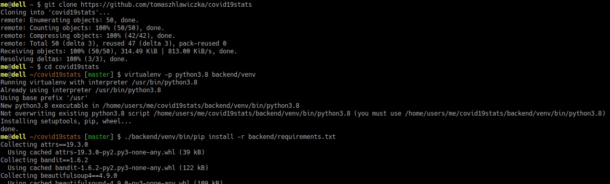
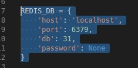
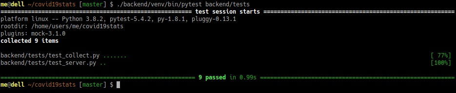
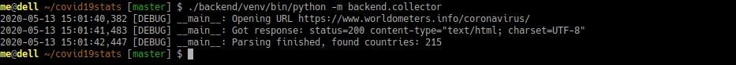
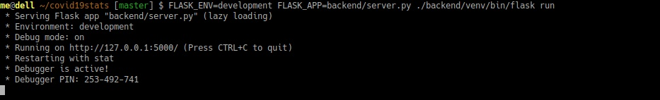
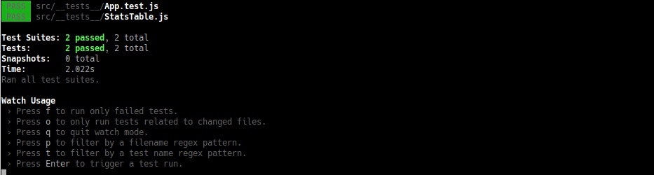
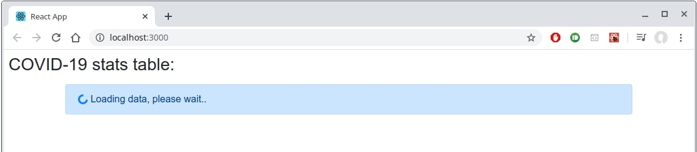
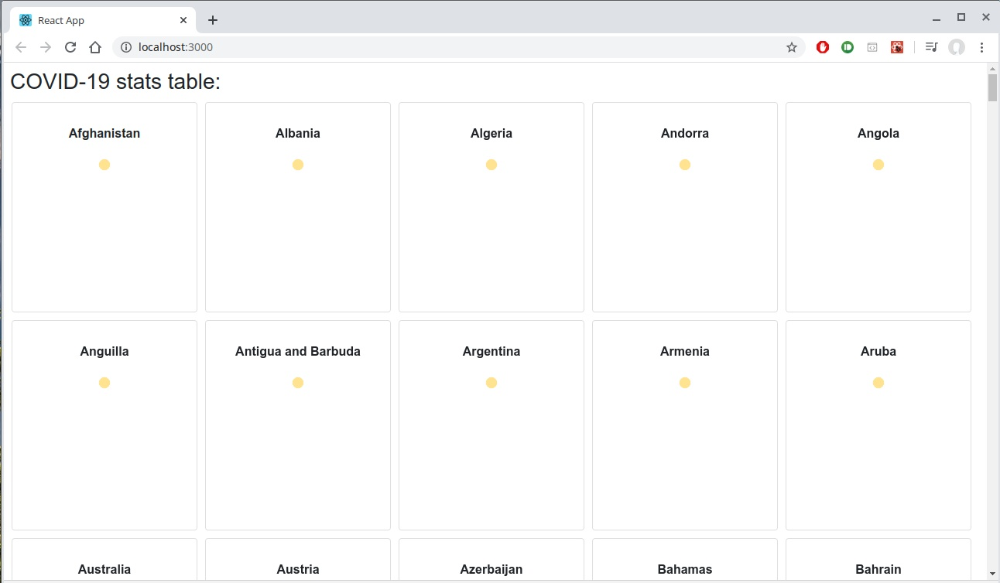
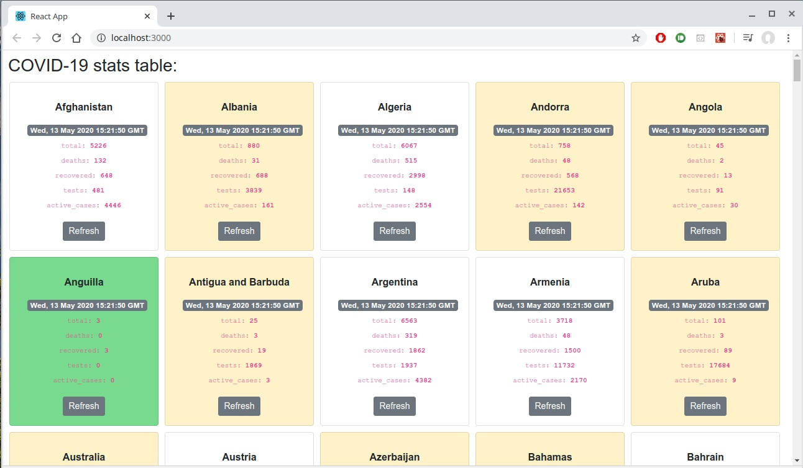
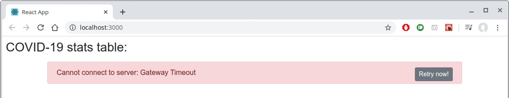

# covid19stats

## Features
 - Reading countries stats (numbers) from https://www.worldometers.info/coronavirus/
 - Collecting data in the local Redis server (see `backend/settings.py` for configuration)
 - Lockingless approach while updating (stats are available for reading all the time)
 - Simple Flask server to publishing stats (REST, JSON format)
 - Simple ReactJS page for prezentation: updating stats with batches

## Installation

```
git clone https://github.com/tomaszhlawiczka/covid19stats
cd covid19stats

virtualenv -p python3.8 backend/venv
./backend/venv/bin/pip install -r backend/requirements.txt

```


## Configuration
See: `backend/settings.py` to setup connection to `Redis` database.



## Tests - backend
```
./backend/venv/bin/pytest backend/tests
```


## Update stats
```
./backend/venv/bin/python -m backend.collector
```


## Running dev backend server
```
FLASK_ENV=development FLASK_APP=backend/server.py ./backend/venv/bin/flask run
```



## Running dev frontend server
```
(cd frontend; yarn install; yarn start)
```
See: http://localhost:3000/


## Tests - frontend
```
(cd frontend; yarn install; yarn test)
```



## Final result
### Step 1 - loading countries list


### Step 2 - loading countries stats with batches


### Step 3 - data loaded, upading periodicly


### Error case - no connection to server


